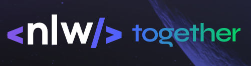

# NLW Valoriza
> Proojeto de estudo dirigido durante a NLW06

Este projeto foi realizado para estudo de tecnologias de NodeJs/JWT/ExpressJS/TypeScript durante a NLW 06. Projeto consta de API para cadastro de elogios entre pessoas de uma equipe.

## Installing / Getting started


```bash
git clone https://github.com/leanfj/nlwvaloriza.git
cd nlwvaloriza
yarn
yarn dev

```

```yarn``` pode ser substituído para ```npm```

```
npm install
npm run dev
```

### Initial Configuration

Todas as dependencias serão instalada utilizando o comando ```yarn``` ou ```npm install```

## Developing


### Building


### Deploying / Publishing

## Features

* cadastro de usuário
* cadastro de tags para elogio
* cadastro de elegios entro usuário
* listagem de usuário
* listagem de tags
* listagem de elogios recebidos e enviados
* autenticação de usuário
* controle de cadastro de tags para usuário administrador

## Configuration

#### Argument 1

#### Argument 2

## Contributing

## Links

## Licensing
